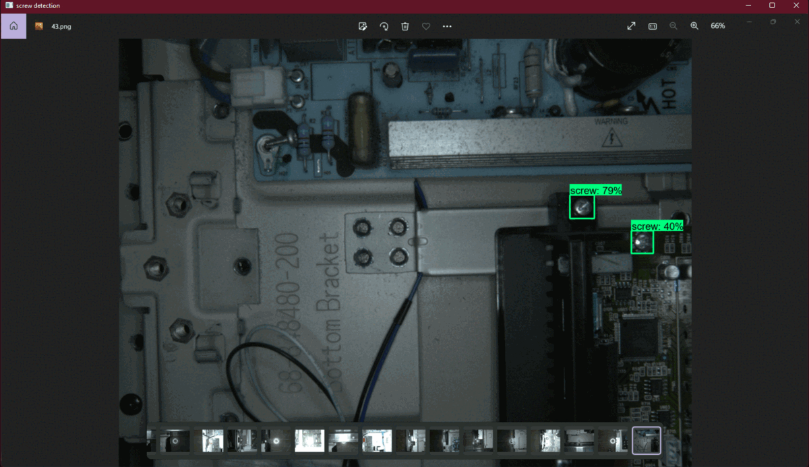

># BASIC SCRIPTS TO IMPLEMENT TRANSFER LEARNING USING OBJECT DETECTION MODELS

**Author: Adedamola Ayodeji Sode**   
**Email: adedamola.sode@gmail.com**

# BRIEF DESCRIPTION 
This project follows the tensorflow documentation, but here's a good tutorial I found that will help you get started:  <a href = "https://www.youtube.com/channel/UCHXa4OpASJEwrHrLeIzw7Yg">Nicholas Renotte</a> on youtube, specifically using this video: <a href ="https://www.youtube.com/watch?v=IOI0o3Cxv9Q&ab_channel=NicholasRenotte">Real Time Face Mask Detection with Tensorflow and Python | Custom Object Detection w/ MobileNet SSD</a>.

# DEPENDENCIES REQUIRED TO BUILD AND RUN
All dependencies used are in their latest versions as of 20-04-22, and their corrsponding libraries and dependencies which follow suit:
1. Tensorflow, with CUDA and CuDNN for GPU acceleration
2. Object-detection-api
3. OpenCV
4. Numpy
5. Pythonautogui for screen capture when testing model

# CONFIGURATION
1. Create a Project folder with this given directory tree:


2. Insert your train and test images and corresponsing .xml labels in the respective train and test folders in the /workspace/images directory

3. Run the run_me file and make adjustments where needed in the pipeline configuration file or set.py module in scripts as needed (Best done with your preferred IDE)

# EXECUTING THE PROGRAM

1. Clone the git 
```bash
git clone  https://github.com/AsimovNo9/ScrewDetection.git
```
2. Run the run_me.py file using your choice of IDE or your commandline (uncomment lines if they are commented) 
```bash
python ./run_me.py
```

# Real Time Detection

Stream screen for possibility of running detections in real time, while scrolling through your browser or watching a video off youtube or something, I think it's a more dexterous way to go. Recommended to extend your display to another monitor, unless you have some work around.

Here are images of me scrolling through images of screws and the model detecting in real time




